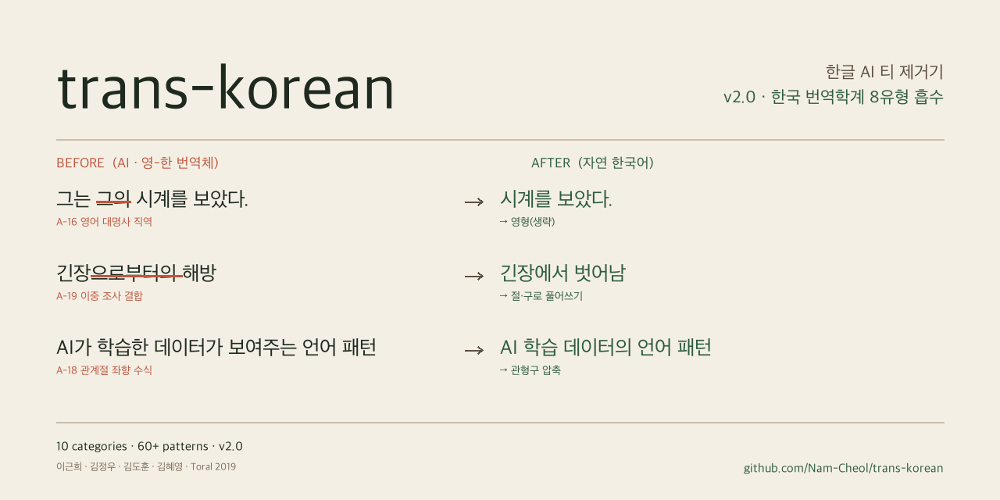

<p align="center">
  
</p>

# trans-korean — Codex 한글 AI 티 제거기

`trans-korean`은 Codex에서 사용하는 한글 문체 윤문 skill/plugin 프로젝트입니다. AI가 쓴 글처럼 보이는 번역투, 기계적인 병렬 구조, 상투적 결론 표현, 피동태 남용, 접속사 남발, 균일한 리듬을 줄이되 원문의 의미와 장르는 유지합니다.

이 저장소는 Claude Code용으로 시작된 [`epoko77-ai/im-not-ai`](https://github.com/epoko77-ai/im-not-ai)를 fork한 뒤, Codex repo skill과 Codex plugin/marketplace 배포 흐름에 맞게 재구성한 버전입니다.

핵심은 새 글을 쓰는 것이 아니라 **의미 보존형 국소 윤문**입니다. 사실, 주장, 수치, 고유명사, 직접 인용은 그대로 두고, 탐지된 AI 티 구간(span)에 근거한 수정만 수행합니다.

## 프로젝트 개요

```text
.
├── AGENTS.md
├── .agents/
│   ├── skills/humanize-korean/
│   │   ├── SKILL.md
│   │   └── references/
│   ├── commands/
│   └── plugins/marketplace.json
├── .codex/agents/
├── plugins/trans-korean-codex/
│   ├── .codex-plugin/plugin.json
│   └── skills/humanize-korean/
├── scripts/
└── tests/
```

- repo skill: `.agents/skills/humanize-korean/`
- distributable plugin wrapper: `plugins/trans-korean-codex/`
- marketplace entry: `.agents/plugins/marketplace.json`
- runtime outputs: `_workspace/{YYYY-MM-DD-NNN}/`

## 제품 원칙

1. **의미 불변**: 사실, 주장, 수치, 날짜, 고유명사, 직접 인용은 보존합니다.
2. **Span-grounded 수정**: 탐지된 AI 티 구간에 연결되는 문장만 국소 수정합니다.
3. **장르 유지**: 칼럼, 리포트, 블로그, 공적 문서의 장르와 격식을 임의로 바꾸지 않습니다.
4. **과윤문 금지**: 변경률 30% 초과 시 경고하고, 50% 초과 시 중단 또는 롤백합니다.
5. **Taxonomy/playbook 기반**: `.agents/skills/humanize-korean/references/ai-tell-taxonomy.md`, `.agents/skills/humanize-korean/references/rewriting-playbook.md`, `.agents/skills/humanize-korean/references/scholarship.md`, `.agents/skills/humanize-korean/references/web-service-spec.md`를 source of truth로 유지합니다.

## Codex에서 repo skill로 사용하기

### 1. 리포 받기

```bash
git clone https://github.com/Nam-Cheol/trans-korean.git
cd trans-korean
```

### 2. 저장소 루트에서 요청하기

Codex CLI, Codex App, Codex IDE에서 저장소 루트를 연 뒤 자연어로 요청합니다.

```text
humanize-korean skill을 사용해서 이 한글 글의 기계적인 문체를 줄여줘.
모드: Fast
장르: 자동
강도: 기본

[윤문할 텍스트]
```

자연어 트리거도 사용할 수 있습니다.

- "AI 티 없애줘"
- "GPT 문체 제거해줘"
- "번역투 제거하고 사람이 쓴 것처럼 윤문해줘"
- "한글 AI 윤문 Strict 모드로 해줘"
- "이 문단만 다시, 번역투만 손봐줘"

재사용 가능한 prompt 예시는 `.agents/commands/humanize.md`, `.agents/commands/humanize-redo.md`에 있습니다. Codex slash command 문법이 아니라 자연어 prompt 템플릿입니다.

## Codex plugin/marketplace로 사용하기

저장소는 배포 가능한 Codex plugin wrapper를 포함합니다.

- plugin manifest: `plugins/trans-korean-codex/.codex-plugin/plugin.json`
- marketplace entry: `.agents/plugins/marketplace.json`
- bundled skill: `plugins/trans-korean-codex/skills/humanize-korean/`

Codex App/CLI에서 이 저장소의 marketplace 파일을 로컬 marketplace로 추가한 뒤 `trans-korean-codex` 플러그인을 설치합니다. 명령 이름은 Codex 버전에 따라 다를 수 있으므로, 사용 중인 Codex의 plugin help에서 marketplace 추가 명령을 확인하세요. 이 저장소 쪽에서 필요한 값은 아래 두 개입니다.

```text
marketplace file: .agents/plugins/marketplace.json
plugin source: ./plugins/trans-korean-codex
```

설치 후 Codex에서 아래처럼 확인합니다.

```text
trans-korean-codex 플러그인의 humanize-korean skill을 사용해서 이 글의 번역투와 기계적인 문체를 줄여줘:

[윤문할 텍스트]
```

## Fast / Strict 모드

**Fast 모드**는 기본 경로입니다. 보통 5,000자 이하 입력에서 단일 skill 흐름으로 탐지, 윤문, 자체검증을 처리합니다.

```text
01_input.txt
  -> quick-rules 기반 탐지/윤문/자체검증
  -> final.md + summary.md
```

**Strict 모드**는 정밀 검증 경로입니다. 사용자가 Strict를 명시하거나, 긴 글, 부분 재실행, 의미 보존 리스크가 큰 글에서 사용합니다.

```text
01_input.txt
  -> 02_detection.json
  -> 03_rewrite.md + 03_rewrite_diff.json
  -> 04_fidelity_audit.json
  -> 05_naturalness_review.json
  -> final.md + summary.md
```

Strict 모드에서만 `.codex/agents/*.toml` 역할 분리 또는 Codex subagent spawn을 사용합니다. 현재 환경에서 subagent를 명시적으로 spawn할 수 없으면 같은 역할을 Codex 본세션에서 순차 수행합니다.

## 산출물 구조

실행 결과는 `_workspace/{YYYY-MM-DD-NNN}/`에 저장합니다.

| 파일 | 모드 | 내용 |
|---|---|---|
| `01_input.txt` | Fast/Strict | 원문 |
| `final.md` | Fast/Strict | 최종 윤문본 |
| `summary.md` | Fast/Strict | 변경률, 등급, 탐지 요약, 자체검증 |
| `02_detection.json` | Strict | span·category·severity 탐지 결과 |
| `03_rewrite.md` | Strict | 중간 윤문본 |
| `03_rewrite_diff.json` | Strict | edit 단위 before/after |
| `04_fidelity_audit.json` | Strict | 의미 보존 감사 |
| `05_naturalness_review.json` | Strict | 잔존 AI 티와 과윤문 검토 |

## Do-NOT list

다음은 탐지·윤문 대상에서 제외합니다.

- 수치, 단위, 날짜, 시간
- 인명, 지명, 기관명, 제품명, 모델명
- 큰따옴표 안 직접 인용
- 법률·규정 조문
- 수학·화학·통계 공식
- 불가피한 학술 개념어와 약어

## 테스트 방법

핵심 metrics 테스트는 Python 표준 라이브러리만 사용합니다. 플러그인 validator와 썸네일 스크립트까지 확인하려면 선택 의존성을 설치합니다.

```bash
python3 -m pip install -r requirements.txt
```

기본 검증:

```bash
python3 -m unittest discover -s tests
python3 tests/test_metrics.py
python3 tests/test_metrics_v2.py
python3 scripts/prepare_monolith_input.py --text "오늘은 비가 온다." --genre essay
```

manifest parse check:

```bash
python3 - <<'PY'
import json, pathlib, tomllib
for p in pathlib.Path(".codex/agents").glob("*.toml"):
    tomllib.loads(p.read_text())
for p in [
    pathlib.Path("plugins/trans-korean-codex/.codex-plugin/plugin.json"),
    pathlib.Path(".agents/plugins/marketplace.json"),
]:
    json.loads(p.read_text())
print("manifest parse OK")
PY
```

썸네일 생성 스크립트는 선택 사항이며 Pillow가 필요합니다. 로컬 Pretendard 폰트가 없으면 macOS 기본 한글 폰트로 fallback합니다.

```bash
python3 scripts/build_social_preview_v2.py
```

## Troubleshooting

- **Codex가 skill을 못 찾는 경우**: 저장소 루트에서 작업 중인지 확인하고 `.agents/skills/humanize-korean/SKILL.md`가 있는지 확인하세요.
- **플러그인이 설치되지 않는 경우**: `.agents/plugins/marketplace.json`의 `source.path`가 `./plugins/trans-korean-codex`인지, `plugins/trans-korean-codex/.codex-plugin/plugin.json`의 `skills`가 `./skills/`인지 확인하세요.
- **repo skill과 plugin skill이 달라진 경우**: `.agents/skills/humanize-korean`과 `plugins/trans-korean-codex/skills/humanize-korean`을 함께 갱신한 뒤 `diff -ru .agents/skills/humanize-korean plugins/trans-korean-codex/skills/humanize-korean`로 확인하세요.
- **테스트는 통과하지만 plugin validator가 실패하는 경우**: `python3 -m pip install -r requirements.txt`로 `PyYAML`을 설치한 뒤 다시 실행하세요.
- **썸네일 생성이 실패하는 경우**: `scripts/build_social_preview_v2.py`는 Pillow가 필요합니다. 로컬 Pretendard 폰트가 없으면 macOS 기본 한글 폰트로 fallback하며, 핵심 skill/plugin 동작과 metrics 테스트에는 필요하지 않습니다.
- **Strict 모드에서 subagent를 쓸 수 없는 경우**: `.codex/agents/*.toml`의 역할을 참고해 Codex 본세션에서 탐지, 윤문, 내용 감사, 자연스러움 검토를 순차 수행하면 됩니다.

## 이전 이름 / fork provenance

이 프로젝트의 원본은 [`epoko77-ai/im-not-ai`](https://github.com/epoko77-ai/im-not-ai)입니다. `trans-korean`은 해당 원본 프로젝트를 fork한 뒤, Codex 전용 repo skill/plugin 배포 흐름에 맞춰 이름, 문서, plugin wrapper를 재정리한 배포판입니다.

원본의 taxonomy/playbook/scholarship/web spec 지식 자산은 `.agents/skills/humanize-korean/references/` 아래에서 계속 유지합니다. 과거 issue, PR, 외부 기여 기록은 [CONTRIBUTORS.md](CONTRIBUTORS.md)에 보존되어 있습니다.
